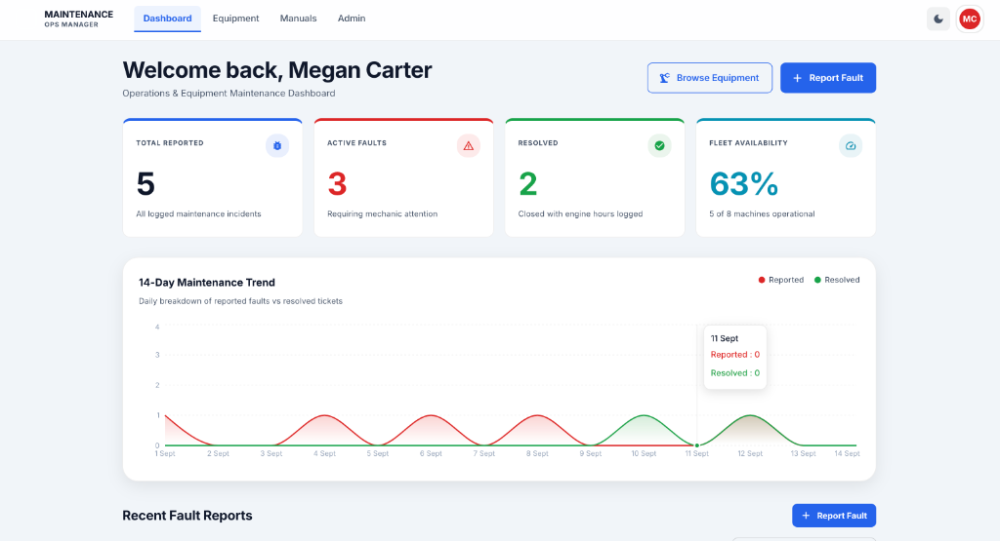
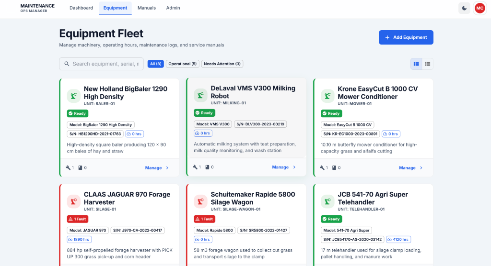

# MaintenanceSystemApp

[](LICENSE)
[](https://nodejs.org/)
[](https://react.dev/)
[](https://expressjs.com/)

A modern, multi-tenant web application designed for comprehensive industrial and commercial equipment maintenance, fault tracking, preventive maintenance scheduling, and spare parts management.

## Screenshots

| Operations & Maintenance Dashboard | Equipment Fleet Management |
|:---:|:---:|
|  |  |

---

## Key Features

- **Multi-Tenant Architecture**: Strict organizational data isolation enforced per tenant (`companyId`) across all database queries, operations, and file storage.
- **Equipment & Tool Management**: Track equipment catalog, upload technical manuals (PDFs), manage machine status, and attach maintenance routines.
- **Fault Tracking & Reporting**: Log faults with multi-photo uploads, status workflows (Open, In Progress, Closed, Reopened), severity/priority levels, and mechanic assignments.
- **Preventive Maintenance Schedules**: Set recurring maintenance plans with actionable task checklists, completion tracking, and historical logs.
- **Spare Parts Inventory**: Monitor replacement parts stock levels, track part usage across maintenance operations, and link parts to specific equipment.
- **Role-Based Access Control (RBAC)**:
  - `admin`: Organization setup, user management, and equipment catalog configuration.
  - `mechanic`: Equipment maintenance, schedule execution, checklist management, fault resolution, and parts tracking.
  - `operator`: Equipment status view, fault reporting with photo uploads, and task visibility.
- **Notifications & Web Push**: Mechanics and admins are alerted the moment a fault is reported, and admins can broadcast announcements to their organization (optionally targeting a single role). Every notification lands in an in-app feed with an unread badge, and is also delivered as a PWA push notification to each device the user has opted in on. Push is optional -- without VAPID keys configured, the in-app feed works unchanged.
- **Progressive Web App (PWA)**: Built with `vite-plugin-pwa` for offline capability, pull-to-refresh on every screen, and mobile-friendly field operations.
- **Robust Security**: Rate-limited authentication, HTTP-only JWT cookies, Helmet HTTP headers, strict CORS origin controls, tenant-scoped media delivery, and recursive NoSQL-operator sanitization on every request body/query/params.

---

## Tech Stack

### Frontend
- **Framework & Tooling**: [React 19](https://react.dev/), [Vite](https://vite.dev/), [Vite PWA](https://vite-pwa-org.netlify.app/)
- **UI & Components**: [Material-UI (MUI v9)](https://mui.com/), [Emotion](https://emotion.sh/)
- **State & Routing**: React Context API, [React Router v7](https://reactrouter.com/)
- **Data Visualization & Scheduling**: [Recharts](https://recharts.org/), [FullCalendar](https://fullcalendar.io/)
- **HTTP Client**: [Axios](https://axios-http.com/) with global auth interceptors and notifications via [Notistack](https://notistack.com/)
- **Testing & Quality**: [Jest](https://jestjs.io/), [React Testing Library](https://testing-library.com/), [ESLint 9](https://eslint.org/)

### Backend
- **Runtime & Framework**: [Node.js](https://nodejs.org/), [Express 5](https://expressjs.com/)
- **Database**: [MongoDB](https://www.mongodb.com/) with [Mongoose 8](https://mongoosejs.com/)
- **Authentication**: JWT (`jsonwebtoken`) delivered via secure, HTTP-only cookies (`cookie-parser`) with bcrypt password hashing
- **File Uploads**: [Multer](https://github.com/expressjs/multer) with tenant-validated media streaming
- **Security & Rate Limiting**: [Helmet](https://helmetjs.github.io/), [CORS](https://github.com/expressjs/cors), [express-rate-limit](https://github.com/express-rate-limit/express-rate-limit)
- **Testing**: [Jest](https://jestjs.io/), [Supertest](https://github.com/ladjs/supertest), [mongodb-memory-server](https://github.com/nodkz/mongodb-memory-server)

---

## Project Structure

```
MaintenanceSystemApp/
├── backend/                  # Express REST API
│   ├── config/               # Database and server configuration
│   ├── constants/            # Shared enums/config (roles, rate limits, fault/schedule status, auth)
│   ├── controllers/          # Thin HTTP layer: parse request, call service, shape response
│   ├── middleware/           # Auth, validation, upload, sanitize, and centralized error middleware
│   ├── models/               # Mongoose data schemas (Tenant-scoped)
│   ├── routes/               # Express API route declarations
│   ├── seeders/               # Database seeding scripts
│   ├── services/              # Business logic and data access, called by controllers
│   ├── uploads/               # Local storage for manuals and images
│   └── __tests__/             # Backend unit and integration tests
├── frontend/                 # React Single Page Application (PWA)
│   ├── src/
│   │   ├── components/       # Feature-specific components (Fault, Tool, User, etc.)
│   │   ├── constants/        # Shared literals (roles, fault status, route paths)
│   │   ├── contexts/         # React contexts (Auth, Equipment, Fault, Notification, Theme, Tool)
│   │   ├── hooks/             # Shared hooks (e.g. useForm)
│   │   ├── pages/             # View pages and route layouts
│   │   ├── services/          # Axios API clients and endpoint wrappers
│   │   └── *.test.jsx / *.test.js  # Co-located component/hook/service tests
│   └── __tests__/             # Additional component tests (login/legal flows)
├── docs/                     # Detailed project documentation
│   ├── API.md                # Full REST API endpoint specification
│   ├── CONTRIBUTING.md       # Development guide, testing, and PR checklist
│   ├── ENV.md                # Environment variable reference
│   └── RUNBOOK.md            # Operations, deployment, health checks, & runbook
├── LICENSE                   # MIT License
└── README.md                 # Project overview and quickstart guide
```

---

## Quickstart Guide

### Prerequisites
- **Node.js**: v18.0.0+ or v20.0.0+ LTS
- **npm**: v9.0.0+
- **MongoDB**: Local instance running on `localhost:27017` or a MongoDB Atlas URI

### 1. Clone the Repository
```bash
git clone https://github.com/yaronserlin/MaintenanceSystemApp.git
cd MaintenanceSystemApp
```

### 2. Install Dependencies
```bash
# Install backend dependencies
cd backend
npm install

# Install frontend dependencies
cd ../frontend
npm install
```

### 3. Configure Environment Variables
Copy template environment files:

```bash
# In backend directory
cp .env.example .env

# In frontend directory
cp .env.example .env
```

*See [docs/ENV.md](docs/ENV.md) for detailed descriptions of all available environment configuration options.*

### 4. Seed the Database
Populate your local MongoDB instance with initial test users, sample equipment, spare parts, and maintenance schedules:

```bash
cd backend
npm run seed
```

### 5. Start Development Servers
Open two terminal tabs:

**Terminal 1 (Backend API on port 5001):**
```bash
cd backend
npm run dev
```

**Terminal 2 (Frontend on port 5173):**
```bash
cd frontend
npm run dev
```

Navigate to `http://localhost:5173` in your browser.

---

## Common Scripts

### Backend (`backend/`)
| Command | Description |
|---------|-------------|
| `npm run dev` | Start backend with nodemon hot-reloading on port 5001 |
| `npm start` | Run backend in production mode |
| `npm run build` | Validate syntax with `node --check app.js` |
| `npm run seed` | Seed database with initial sample data |
| `npm test` | Run backend tests with Jest and in-memory MongoDB |

### Frontend (`frontend/`)
| Command | Description |
|---------|-------------|
| `npm run dev` | Start Vite dev server on port 5173 with HMR |
| `npm run build` | Build production assets to `dist/` |
| `npm run preview` | Locally preview production build |
| `npm run lint` | Run ESLint static analysis |
| `npm test` | Run frontend unit & component tests |

---

## Documentation

Comprehensive project documentation is maintained in the [`docs/`](docs/) directory:

- 📖 **[REST API Specification](docs/API.md)**: Full endpoint reference, authentication patterns, request parameters, and response structures.
- ⚙️ **[Environment Variables](docs/ENV.md)**: Detailed reference table for backend and frontend environment configuration.
- 🛠️ **[Contributing Guide](docs/CONTRIBUTING.md)**: Development workflow, environment setup, testing procedures, code style rules, and PR checklist.
- 🚀 **[Operations Runbook](docs/RUNBOOK.md)**: Cloud deployment instructions, health check monitoring, common issues and troubleshooting, and incident response.

---

## License

This project is licensed under the MIT License - see the [LICENSE](LICENSE) file for details.
